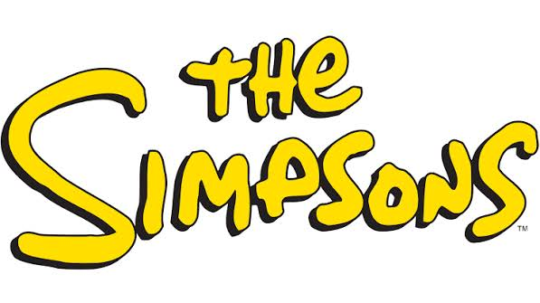
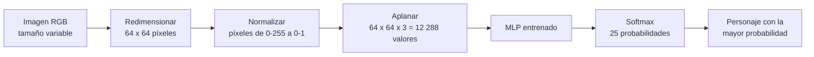
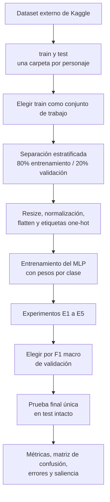
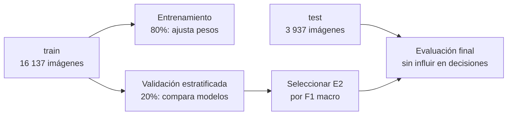
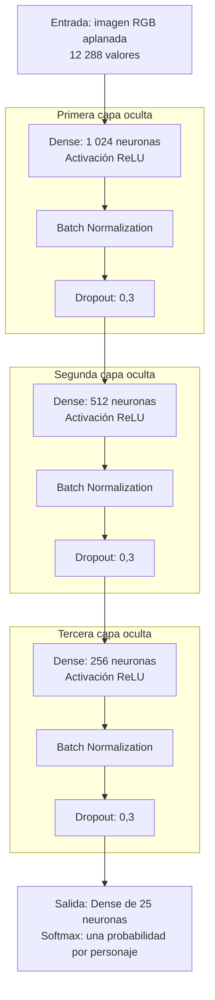

# Clasificador de personajes de Los Simpson con un MLP

Este repositorio contiene un proyecto de Machine Learning que entrena, compara y evalúa un **Perceptrón Multicapa (MLP)** para identificar cuál de **25 personajes de Los Simpson** aparece en una imagen RGB. La implementación, el análisis y la predicción están en el notebook [LosSimpsonsPMC.ipynb](notebooks/LosSimpsonsPMC.ipynb).

> Es un proyecto didáctico de clasificación de imágenes. No detecta la posición de un personaje, no dibuja cajas y no asigna varias etiquetas a una misma imagen.

<p align="center">
  
</p>

## Qué hace el modelo

Ante una imagen, el modelo calcula una probabilidad para cada personaje y devuelve la clase con mayor probabilidad. Por ejemplo, puede decidir entre `homer_simpson`, `lisa_simpson` o `marge_simpson`.



Técnicamente, es una **clasificación multiclase de etiqueta única**:

| Elemento | Implementación |
|---|---|
| Entrada | Imagen RGB convertida a un vector de 12.288 valores. |
| Clases | 25 personajes; cada imagen tiene una sola etiqueta. |
| Salida | 25 probabilidades con `softmax`; se elige el valor máximo (`argmax`). |
| Pérdida | `categorical_crossentropy`. |
| Selección del modelo | F1 macro sobre validación, para dar el mismo peso a cada personaje. |

## Resultados principales

El modelo final seleccionado es el experimento **E2**, con tres capas ocultas. Se evaluó una sola vez en 3.937 imágenes de prueba que no se usaron para entrenar ni para escoger hiperparámetros.

| Métrica de prueba | Resultado | Significado |
|---|---:|---|
| Accuracy | **53,3 %** | Acertó algo más de la mitad de todas las imágenes. |
| F1 macro | **50,7 %** | Rendimiento medio de los 25 personajes, sin favorecer a los que tienen más imágenes. |
| F1 ponderado | 53,2 % | F1 que considera el tamaño de cada clase. |
| Top-3 accuracy | 73,3 % | La respuesta correcta quedó entre las tres opciones más probables. |
| Azar | 4,0 % | Elegir aleatoriamente una de 25 clases. |
| Clase mayoritaria | 11,4 % | Predecir siempre a Homero. |

El modelo aprende patrones reales y supera claramente las referencias simples. Aun así, no es un sistema listo para producción: un MLP pierde la información espacial de una imagen al aplanarla. Una CNN o *transfer learning* sería la evolución técnica natural.

## Flujo completo



### Datos y desbalance

Se usa el dataset de Kaggle [Los Simpson Dataset](https://www.kaggle.com/datasets/alfaro96/los-simpson/data), del usuario `alfaro96`. El flujo del notebook utiliza 16.137 imágenes en `train` y 3.937 en `test`, para 25 personajes.

Las clases están desbalanceadas: `homer_simpson` tiene 1.796 imágenes de entrenamiento y `selma_bouvier` 82, una razón aproximada de 22:1. Por eso no basta con mirar *accuracy*. Durante el entrenamiento se aplican **pesos por clase** (`class_weight`), calculados solamente desde entrenamiento, para que equivocarse en una clase escasa tenga mayor impacto en la pérdida.



## Arquitectura elegida

Cada imagen de `64 × 64 × 3` se convierte en una fila de 12.288 números. La arquitectura E2 procesa esa fila así:



- **ReLU:** función de activación que facilita el entrenamiento de capas profundas.
- **Batch Normalization:** mantiene estables las escalas de activación.
- **Dropout 0,3:** desactiva neuronas al azar durante el entrenamiento para reducir el sobreajuste.
- **Adam (`lr=1e-3`):** optimizador que ajusta los pesos.
- **EarlyStopping, ReduceLROnPlateau y ModelCheckpoint:** frenan, ajustan y guardan el entrenamiento según la validación.

La arquitectura base (`512 → 256`) tiene cerca de 6,43 millones de parámetros. E2 amplía la red a `1024 → 512 → 256`, con aproximadamente 13,25 millones de parámetros.

## Comparación de experimentos

Cada experimento modifica una sola variable, manteniendo la semilla, división de datos, pesos por clase y callbacks. Así, el cambio observado se puede atribuir mejor a la variable evaluada.

| Experimento | Cambio frente al base | F1 macro validación | Accuracy validación |
|---|---|---:|---:|
| **E2, seleccionado** | Tres capas: `1024 → 512 → 256` | **0,486** | **0,510** |
| Base | Dos capas: `512 → 256` | 0,438 | 0,480 |
| E5 | Batch de 512 | 0,408 | 0,441 |
| E4 | Learning rate `1e-4` | 0,393 | 0,433 |
| E1 | Una capa de 512 neuronas | 0,253 | 0,280 |
| E3 | Activación `tanh` | 0,007 | 0,034 |

## Estructura del repositorio

```text
.
├── notebooks/LosSimpsonsPMC.ipynb  # MLP: código, entrenamiento, evaluación y predicción
├── notebooks/LosSimpsons_GPU_4060M.ipynb # Mismo MLP, entrenado en GPU (WSL + RTX 4060)
├── notebooks/README_GPU.md         # Cómo ejecutar el notebook en GPU
├── docs/GUIA_DEL_PROYECTO.md       # Análisis técnico completo del trabajo
├── docs/                           # Material de apoyo de la asignatura
├── data/
│   ├── README.md                   # Fuente y estructura esperada de los datos
│   ├── raw/                        # Datos descargados, ignorados por Git
│   └── processed/                  # Datos derivados, ignorados por Git
├── models/                         # Modelos .keras regenerables, ignorados por Git
├── images/                         # Recursos visuales
├── requirements.txt                # Dependencias Python
└── README.md                       # Este documento
```

## Cómo reproducir el proyecto

### 1. Instalar dependencias

Se requiere Python, Jupyter y una instalación compatible de TensorFlow.

```bash
python -m venv .venv
source .venv/bin/activate  # En Windows: .venv\\Scripts\\activate
pip install -r requirements.txt
```

### 2. Descargar los datos fuera del repositorio

Las imágenes pesan cerca de 1 GB y no se incluyen en Git. Descarga el dataset desde Kaggle, descomprímelo en una ubicación externa y verifica esta organización:

```text
LosSimpsonsDataset/
├── train/
│   ├── homer_simpson/
│   ├── lisa_simpson/
│   └── ...
└── test/
    ├── homer_simpson/
    ├── lisa_simpson/
    └── ...
```

En la primera celda de configuración del notebook, cambia `DATASET_BASE` a esa carpeta:

```python
from pathlib import Path

DATASET_BASE = Path("C:/ruta/a/LosSimpsonsDataset")
conjunto = "train"
```

El conjunto de prueba es siempre el opuesto: si se entrena con `train`, el notebook reserva `test` para la evaluación final.

### 3. Ejecutar el notebook en orden

```bash
jupyter notebook notebooks/LosSimpsonsPMC.ipynb
```

Los modelos resultantes se generan en `models/`: `mlp_base.keras`, `mlp_e1.keras` a `mlp_e5.keras` y `mlp_final.keras`. Son artefactos regenerables e ignorados por Git.

## Límites del enfoque y mejoras

La principal limitación del MLP aparece al aplanar la imagen: no entiende que dos píxeles vecinos estaban cerca ni reutiliza un mismo patrón visual si aparece en otra posición. También puede asociar fondos frecuentes con personajes.

| Limitación | Efecto | Mejora recomendada |
|---|---|---|
| No conserva estructura espacial | No modela rasgos locales como bordes, ojos o siluetas. | CNN. |
| Sensible a posición y escala | Un personaje desplazado se parece a un caso nuevo. | CNN y aumento de datos. |
| Muchos parámetros | Mayor costo y riesgo de sobreajuste. | Convoluciones y *pooling*. |
| Clases desbalanceadas | Los personajes minoritarios pueden quedar mal representados. | Aumento de datos, focal loss o sobremuestreo con transformaciones. |
| Fondos compartidos | Puede aprender el escenario en vez del personaje. | Recortar/detectar personaje antes de clasificar. |

## Referencias internas

- [Información de los datos](data/README.md): fuente y estructura esperada.
- [Notebook principal](notebooks/LosSimpsonsPMC.ipynb): implementación ejecutable.
- [Notebook GPU](notebooks/LosSimpsons_GPU_4060M.ipynb): mismo MLP entrenado sobre GPU en WSL.
- [Guía de ejecución en GPU](notebooks/README_GPU.md): requisitos, kernel CUDA y solución de problemas.

## Integrantes

- Vincent Farenden Cerón
- Rodrigo Ignacio Martínez Becker
- Iván Manuel Pavón Barría
- Diego Ignacio Peña y Lillo Luhrs

Trabajo para la asignatura **Técnicas Avanzadas para Machine Learning_001D**.
