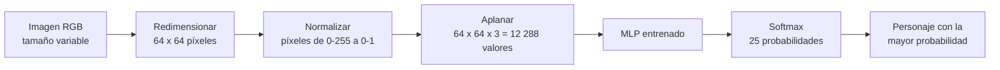
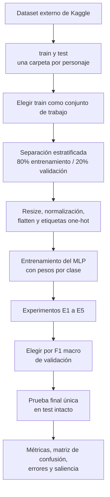
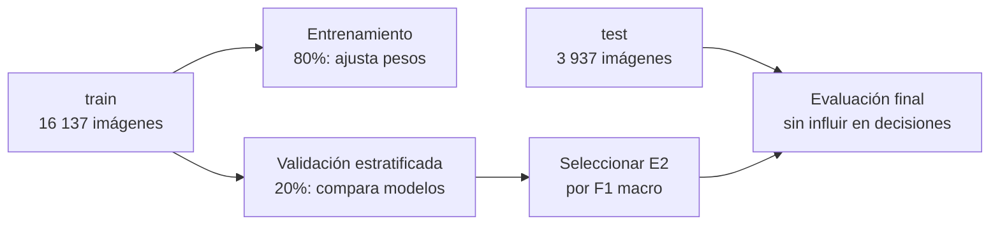
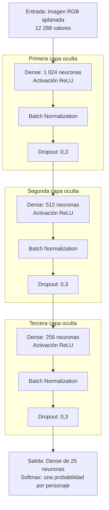
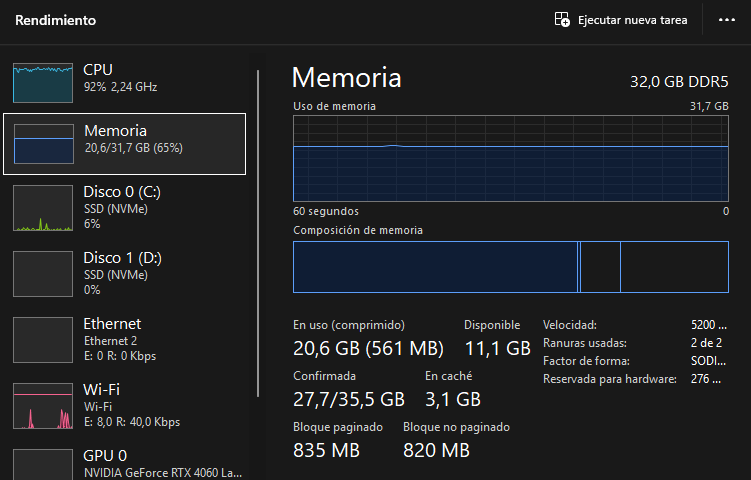
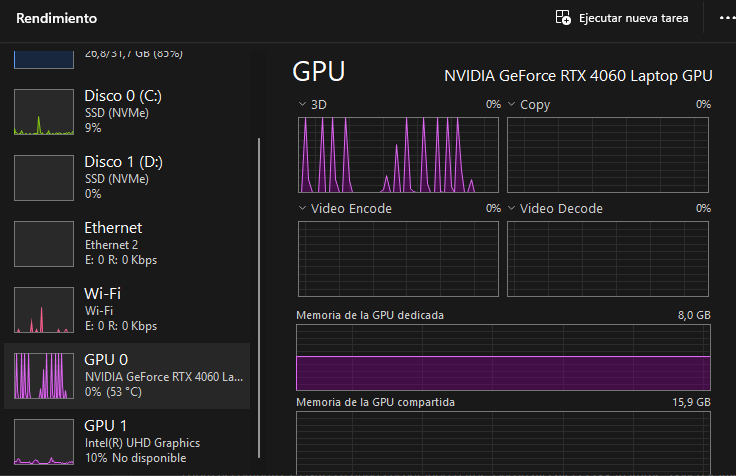

# Clasificador de personajes de Los Simpson con un MLP

Este repositorio contiene un proyecto de Machine Learning que entrena, compara y evalúa un **Perceptrón Multicapa (MLP)** para identificar cuál de **25 personajes de Los Simpson** aparece en una imagen RGB. La implementación, el análisis y la predicción están en el notebook [LosSimpsonsPMC.ipynb](notebooks/LosSimpsonsPMC.ipynb).

> Es un proyecto didáctico de clasificación de imágenes. No detecta la posición de un personaje, no dibuja cajas y no asigna varias etiquetas a una misma imagen.

<p align="center">
  
</p>

## Qué hace el modelo

Ante una imagen, el modelo calcula una probabilidad para cada personaje y devuelve la clase con mayor probabilidad. Por ejemplo, puede decidir entre `homer_simpson`, `lisa_simpson` o `marge_simpson`.



Técnicamente, es una **clasificación multiclase de etiqueta única**:

| Elemento | Implementación |
|---|---|
| Entrada | Imagen RGB convertida a un vector de 12.288 valores. |
| Clases | 25 personajes; cada imagen tiene una sola etiqueta. |
| Salida | 25 probabilidades con `softmax`; se elige el valor máximo (`argmax`). |
| Pérdida | `categorical_crossentropy`. |
| Selección del modelo | F1 macro sobre validación, para dar el mismo peso a cada personaje. |

## Resultados principales

El modelo final seleccionado es el experimento **E2**, con tres capas ocultas. Se evaluó una sola vez en 3.937 imágenes de prueba que no se usaron para entrenar ni para escoger hiperparámetros.

| Métrica de prueba | Resultado | Significado |
|---|---:|---|
| Accuracy | **53,3 %** | Acertó algo más de la mitad de todas las imágenes. |
| F1 macro | **50,3 %** | Rendimiento medio de los 25 personajes, sin favorecer a los que tienen más imágenes. |
| F1 ponderado | 53,4 % | F1 que considera el tamaño de cada clase. |
| Top-3 accuracy | 73,3 % | La respuesta correcta quedó entre las tres opciones más probables. |
| Azar | 4,0 % | Elegir aleatoriamente una de 25 clases. |
| Clase mayoritaria | 11,4 % | Predecir siempre a Homero. |

El modelo aprende patrones reales y supera claramente las referencias simples. Aun así, no es un sistema listo para producción: un MLP pierde la información espacial de una imagen al aplanarla. Una CNN o *transfer learning* sería la evolución técnica natural.

## Flujo completo



### Datos y desbalance

Se usa el dataset de Kaggle [Los Simpson Dataset](https://www.kaggle.com/datasets/alfaro96/los-simpson/data), del usuario `alfaro96`. El flujo del notebook utiliza 16.137 imágenes en `train` y 3.937 en `test`, para 25 personajes.

Las clases están desbalanceadas: `homer_simpson` tiene 1.796 imágenes de entrenamiento y `selma_bouvier` 82, una razón aproximada de 22:1. Por eso no basta con mirar *accuracy*. Durante el entrenamiento se aplican **pesos por clase** (`class_weight`), calculados solamente desde entrenamiento, para que equivocarse en una clase escasa tenga mayor impacto en la pérdida.



## Arquitectura elegida

Cada imagen de `64 × 64 × 3` se convierte en una fila de 12.288 números. La arquitectura E2 procesa esa fila así:



- **ReLU:** función de activación que facilita el entrenamiento de capas profundas.
- **Batch Normalization:** mantiene estables las escalas de activación.
- **Dropout 0,3:** desactiva neuronas al azar durante el entrenamiento para reducir el sobreajuste.
- **Adam (`lr=1e-3`):** optimizador que ajusta los pesos.
- **EarlyStopping, ReduceLROnPlateau y ModelCheckpoint:** frenan, ajustan y guardan el entrenamiento según la validación.

La arquitectura base (`512 → 256`) tiene cerca de 6,43 millones de parámetros. E2 amplía la red a `1024 → 512 → 256`, con aproximadamente 13,25 millones de parámetros.

## Comparación de experimentos

Cada experimento modifica una sola variable, manteniendo la semilla, división de datos, pesos por clase y callbacks. Así, el cambio observado se puede atribuir mejor a la variable evaluada.

| Experimento | Cambio frente al base | F1 macro validación | Accuracy validación |
|---|---|---:|---:|
| **E2, seleccionado** | Tres capas: `1024 → 512 → 256` | **0,486** | **0,510** |
| Base | Dos capas: `512 → 256` | 0,438 | 0,480 |
| E5 | Batch de 512 | 0,408 | 0,441 |
| E4 | Learning rate `1e-4` | 0,393 | 0,433 |
| E1 | Una capa de 512 neuronas | 0,253 | 0,280 |
| E3 | Activación `tanh` | 0,007 | 0,034 |

## Rendimiento: CPU frente a GPU

Los dos notebooks entrenan el mismo MLP sobre los mismos datos y la misma partición. Las seis
corridas se hicieron en el mismo equipo —Intel Core i7-13620H con NVIDIA GeForce RTX 4060
Laptop, conectado a la corriente— y cada una deja su resumen en
`resultados/<CPU|GPU>/rendimiento_<entorno>_<resolución>.json`.

**Los dos entornos no usan el mismo framework.** El notebook de CPU corre sobre TensorFlow
2.21 en Windows; el de GPU, sobre Keras 3 con backend PyTorch, también en Windows nativo.
TensorFlow dejó de soportar GPU en Windows en la versión 2.11, así que no había forma de usar
el mismo framework en ambos sin meterse en WSL. La consecuencia es que las diferencias de
tiempo que siguen **mezclan hardware y framework** y no deben leerse como una medida limpia
de la ganancia del hardware.

### Enchufa el portátil antes de medir

Es el factor más grande y el más fácil de pasar por alto. Con batería, el firmware limita la
GPU a 50 W de los 80 W disponibles y el reloj cae de 2.340 a 1.755 MHz; el tiempo por época
se duplica. La tarjeta sigue marcando **100 % de uso** mientras tanto, porque ese porcentaje
mide *ocupación*, no potencia entregada. Todas las cifras de esta sección se tomaron con el
equipo conectado y en modo de máximo rendimiento.

### Tiempo por época

La comparación usa `benchmark_segundos_por_epoca`, la única cifra homogénea: reentrena la
arquitectura base unas pocas épocas con el mismo batch y sin parada temprana, descartando la
primera porque incluye el calentamiento. Los tiempos de las secciones anteriores no sirven
para comparar, ya que la parada temprana hace que cada configuración corra un número distinto
de épocas.

| Resolución | Segundos/época CPU | Segundos/época GPU | Aceleración | Corrida completa CPU | Corrida completa GPU |
|---|---:|---:|---:|---:|---:|
| 32 × 32 | 1,27 | 0,57 | **2,2 ×** | 12:32 | 3:20 |
| 64 × 64 | 6,87 | 0,59 | **11,6 ×** | 19:44 | 3:09 |
| 128 × 128 | 16,49 | 0,89 | **18,5 ×** | 44:40 | 4:48 |

### Qué muestran estos números

**La GPU sigue limitada por la sobrecarga, no por el cálculo.** Su columna es casi plana
—0,57 → 0,59 → 0,89 segundos por época— mientras la entrada crece dieciséis veces. Con 12.909
imágenes y batch de 128 son unos 101 pasos por época, cada uno demasiado pequeño: lo que se
mide es el lanzamiento de los *kernels*, no las multiplicaciones de matrices. La diferencia
respecto de versiones anteriores de este proyecto es *dónde* está el piso: bajó de ~1,4 a
~0,6 segundos por época.

**Ese piso se bajó quitando dos cuellos de botella, no cambiando de tarjeta.** Primero, los
datos ahora viven enteros en la VRAM en `uint8` y el escalado a [0, 1] lo hace una capa
`Rescaling` dentro del modelo, así que ningún paso espera a que le copien el lote desde la
RAM. Segundo, el entrenamiento ya no pasa por `model.fit()`, que devuelve el control al
intérprete de Python entre paso y paso: a igualdad de todo lo demás, el bucle propio resulta
**2,3 × más rápido** que `fit()` con el mismo tamaño de lote (0,81 frente a 1,89 segundos por
época en una medición controlada).

Conviene ser preciso con lo que eso significa, porque el porcentaje de uso engaña: a batch
128 el bucle propio marca una utilización parecida a la de `fit()` —en torno al 62 %— y aun
así es más del doble de rápido, porque desperdicia menos tiempo en cada paso. La tarjeta solo
se acerca al 97 % cuando el lote sube a 512 o más, donde cada paso ya trae trabajo suficiente
para mantenerla ocupada. Los detalles están en
[notebooks/README_GPU.md](notebooks/README_GPU.md).

<p align="center">
  
  
</p>

<p align="center"><em>Capturas del montaje anterior (WSL2 + TensorFlow), conservadas porque
ilustran el problema que se corrigió. Izquierda: entrenamiento en CPU, con el procesador
saturado al 92 %. Derecha: entrenamiento en GPU, donde TensorFlow reserva los 8 GB de VRAM
pero el uso del núcleo sube a picos y vuelve a cero entre lote y lote. Con el montaje actual
la VRAM ocupada baja a ~1,5 GB y el uso deja de caer a cero entre pasos.</em></p>

**La CPU escala de forma casi lineal con el tamaño de la entrada:** 1,27 → 6,87 → 16,49
segundos por época, factores de 5,4 y 2,4 cuando la entrada se multiplica por 4 cada vez.
Trabaja a plena carga todo el tiempo.

**Ya no hay punto de cruce.** En la versión anterior la CPU ganaba en 32 × 32; ahora la GPU es
más rápida en las tres resoluciones, incluso en la más pequeña.

**En inferencia la ventaja dejó de invertirse.** Antes la CPU era más rápida prediciendo,
porque `predict` sobre un modelo denso pequeño no amortizaba el traslado de datos por PCIe.
Con los datos ya residentes en la VRAM ese traslado desaparece:

| Resolución | Imágenes/s CPU | Imágenes/s GPU |
|---|---:|---:|
| 32 × 32 | 18.475 | 68.136 |
| 64 × 64 | 3.808 | 82.365 |
| 128 × 128 | 2.799 | 70.863 |

**Cambiar de dispositivo no cambia lo que el modelo aprende.** El *accuracy* de prueba se
mantiene en la misma banda en las seis corridas —51,1 / 53,3 / 52,9 % en CPU y 52,5 / 53,6 /
51,7 % en GPU—, que es justamente lo que debe ocurrir. Tampoco lo cambia la resolución. El
techo de ~53 % pertenece a la arquitectura, no al hardware ni al tamaño de la imagen, y es la
misma limitación descrita en [Límites del enfoque y mejoras](#límites-del-enfoque-y-mejoras):
un MLP aplana la imagen y pierde su estructura espacial.

### Cuánta GPU queda sin usar

La utilización media durante el entrenamiento, medida con `nvidia-smi` mientras corre el
*benchmark*, muestra que a batch 128 sobra tarjeta:

| Resolución | Utilización media | Potencia media |
|---|---:|---:|
| 32 × 32 | 29,6 % | 10,8 W |
| 64 × 64 | 30,9 % | 18,5 W |
| 128 × 128 | 59,7 % | 52,6 W |

El margen está en el tamaño de lote. Manteniendo todo lo demás igual, a 128 × 128 el
rendimiento pasa de 15.015 imágenes por segundo con batch 128 a 70.444 con batch 2.048, un
factor de 4,7, y la utilización sube del 61,9 % al 96,6 %. El estudio se queda en **batch 128** porque es el valor con el que se comparan
CPU y GPU, no porque sea el más rápido; la tabla completa se mide en cada corrida y queda
guardada en el JSON de resultados.

### Configuración recomendada

| Escenario | Elección | Motivo |
|---|---|---|
| Con GPU disponible | 64 × 64 en GPU | Mejor F1 macro (0,5104) y *accuracy* (53,6 %) de las seis corridas, en 3:09. |
| Solo CPU | 32 × 32 en CPU | 12:32 para prácticamente el mismo resultado que 128 × 128, que tarda 44:40. |
| A evitar | 128 × 128 en CPU | Es la combinación más cara y no mejora ninguna métrica. |

Hay una consecuencia práctica: en GPU la resolución sale casi gratis mientras no se supere el
piso de sobrecarga, así que el argumento de bajar la resolución para acelerar el entrenamiento
deja de aplicar en cuanto hay una GPU disponible. El cuello de botella pasa a ser la
arquitectura, y el siguiente paso natural del proyecto es una CNN que aproveche esos 49.152
valores como estructura espacial y no como un vector plano.

## Estructura del repositorio

```text
.
├── notebooks/
│   ├── LosSimpsonsPMC.ipynb        # MLP: código, entrenamiento, evaluación y predicción
│   ├── LosSimpsons_GPU_4060M.ipynb # Mismo MLP en GPU (Windows nativo + RTX 4060)
│   └── README_GPU.md               # Cómo ejecutar el notebook en GPU
├── docs/
│   ├── Informe.md                  # Informe técnico del proyecto
│   ├── EP1_TLY1102_Instrucciones y Pauta PRESENTACIÓN_Estudiante.pdf
│   └── material_complementario/    # Material de apoyo de la asignatura
├── models/                         # Modelos .keras regenerables, ignorados por Git
├── models_gpu/                     # Modelos de las corridas en GPU, ignorados por Git
├── resultados/
│   ├── CPU/                        # rendimiento_cpu_<resolucion>.json
│   └── GPU/                        # rendimiento_gpu_<resolucion>.json
├── images/                         # Recursos visuales
├── scripts/
│   └── ejecutar_notebook_gpu.ps1   # Ejecuta el notebook de GPU sin abrir Jupyter
├── requirements.txt                # Dependencias Python (CPU)
├── requirements-gpu-windows.txt    # Dependencias del entorno GPU
└── README.md                       # Este documento
```

El dataset no forma parte del repositorio: se descarga aparte y se deja en una ubicación externa, como se explica en [Descargar los datos fuera del repositorio](#2-descargar-los-datos-fuera-del-repositorio).

## Cómo reproducir el proyecto

### 1. Instalar dependencias

Se requiere Python y Jupyter. El notebook de CPU usa TensorFlow; el de GPU usa Keras 3 sobre PyTorch y tiene su propio entorno, descrito en `requirements-gpu-windows.txt` y en [notebooks/README_GPU.md](notebooks/README_GPU.md).

```bash
python -m venv .venv
source .venv/bin/activate  # En Windows: .venv\\Scripts\\activate
pip install -r requirements.txt
```

### 2. Descargar los datos fuera del repositorio

El dataset son unas 20.000 imágenes que ocupan 550 MB (577.675.264 bytes) y no se incluyen en Git. Descarga el dataset desde Kaggle, descomprímelo en una ubicación externa y verifica esta organización:

```text
LosSimpsonsDataset/
├── train/
│   ├── homer_simpson/
│   ├── lisa_simpson/
│   └── ...
└── test/
    ├── homer_simpson/
    ├── lisa_simpson/
    └── ...
```

En la primera celda de configuración del notebook, cambia `DATASET_BASE` a esa carpeta:

```python
from pathlib import Path

DATASET_BASE = Path("C:/ruta/a/LosSimpsonsDataset")
conjunto = "train"
```

El conjunto de prueba es siempre el opuesto: si se entrena con `train`, el notebook reserva `test` para la evaluación final.

### 3. Ejecutar el notebook en orden

```bash
jupyter notebook notebooks/LosSimpsonsPMC.ipynb
```

Los modelos resultantes se generan en `models/`: `mlp_base.keras`, `mlp_e1.keras` a `mlp_e5.keras` y `mlp_final.keras`. Son artefactos regenerables e ignorados por Git.

## Límites del enfoque y mejoras

La principal limitación del MLP aparece al aplanar la imagen: no entiende que dos píxeles vecinos estaban cerca ni reutiliza un mismo patrón visual si aparece en otra posición. También puede asociar fondos frecuentes con personajes.

| Limitación | Efecto | Mejora recomendada |
|---|---|---|
| No conserva estructura espacial | No modela rasgos locales como bordes, ojos o siluetas. | CNN. |
| Sensible a posición y escala | Un personaje desplazado se parece a un caso nuevo. | CNN y aumento de datos. |
| Muchos parámetros | Mayor costo y riesgo de sobreajuste. | Convoluciones y *pooling*. |
| Clases desbalanceadas | Los personajes minoritarios pueden quedar mal representados. | Aumento de datos, focal loss o sobremuestreo con transformaciones. |
| Fondos compartidos | Puede aprender el escenario en vez del personaje. | Recortar/detectar personaje antes de clasificar. |

## Referencias internas

- [Informe técnico](docs/Informe.md): problema de negocio, KPIs, EDA, metodología CRISP-DM y análisis de resultados.
- [Pauta de la evaluación](docs/EP1_TLY1102_Instrucciones%20y%20Pauta%20PRESENTACI%C3%93N_Estudiante.pdf): instrucciones y rúbrica.
- [Notebook principal](notebooks/LosSimpsonsPMC.ipynb): implementación ejecutable.
- [Notebook GPU](notebooks/LosSimpsons_GPU_4060M.ipynb): mismo MLP entrenado sobre GPU en Windows nativo, con un bucle de entrenamiento propio sobre PyTorch.
- [Guía de ejecución en GPU](notebooks/README_GPU.md): entorno de Windows nativo, decisiones de rendimiento y solución de problemas.
- [Resúmenes de rendimiento](resultados/): un JSON por corrida con tiempos, entorno y métricas.

## Integrantes

- Vincent Farenden Cerón
- Rodrigo Ignacio Martínez Becker
- Iván Manuel Pavón Barría
- Diego Ignacio Peña y Lillo Luhrs

Trabajo para la asignatura **Técnicas Avanzadas para Machine Learning_001D**.
